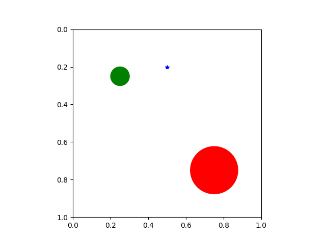
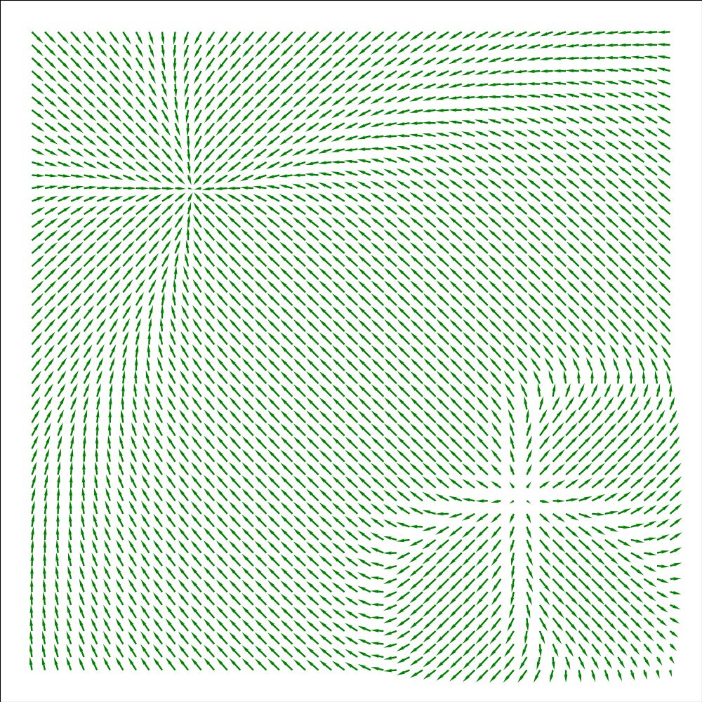

# Project for Autonomous and Adaptive Systems

The goal of this project was to experiment with reinforcement learning techniques in continuous state-action spaces. 
In this work I try different ideas taken from state of the art results in model free policy gradient methods and tests how they can work together, testing the algorithms on a simple environment with continuous low dimensional state-action spaces with sparse rewards. 

Specifically in this work I started from a Proximal Policy Optimization (PPO) clip style algorithm and in order to encourage exploration and limit early convergence I introduced a new kind of regularization to solve the instability of the entropy regularizer in continuous action spaces. 
I also experimented with SAC style regularization adding adding the entropy bonus directly inside the reward. I then tested the viability of adding experience replay to further increase the sample efficiency of the algorithm.
I took inspiration by Actor-Critic with Experience Replay (ACER) for the estimators of the gradient and for the network architecture, while substituting the TRPO style update with a PPO clip one, and removing the stochastic part form the Stocastic Dueling Network used for the V and Q value functions. 
I also tested different architecture and features to make the neural networks more suited to deal with coordinates as inputs.
For testing a simple low dimensional environment with sparse rewad has been created.

For the complete details of the project see the report pdf.

Utilization of existing code or RL-libraries was not allowed and it's all written from scratch.


## Installation

I provide the yml file to recreate the conda environment (tested on Windows)

```
conda env create -f conda_env.yml
```
the file calls the environment rl-project-bortolato, modify the yml file if needed.


The project uses common libraries, and probably will work fine without creating a new environment. The main library used is pytorch with cuda support (the code was written to be launched on a cuda machine). Tensorboard was used for logging.


## Launching the code

The main notebook to lauch the trainings is rl-project-final.ipynb.
The notebook is set up to lauch multiple tests in a sequence (to launch the experiments on the server). 
The variables changed throughout the experiments are in the EXPERIMENTS dict, while the others are just set before launching the experiments.

The code can be run on Kaggle servers by creating a library with the files

- agents.py
- environment.py
- replay_buffers.py
- utils.py

importing the library in the notebook and adding the folder to the path (see first cell in the notebook)

The code plots the policy and the value function for a validation plane, which can be setup at the beginning by setting the position of the validation_reward and the validation_blackhole.


## Visualizing the results

To visualize the policy in action use visualize_policy.ipynb where you can set the parameters of the simulations and run it with an agent.

<p float="left">
  
  
</p>


Here is an example of the visualization where the blue star is the space-ship that has to reach the goal (green dot) while being pulled by the black-hole (red dot). On the left the agent before training and on the right after training.

Using tensorboard is the easiest way to visualize the runs and understand the behaviour of the algorithm.

```
tensorboard --logdir runs
```

On tensorboard are saved both the scalars (reward, losses, ...) and the policy and value function visualizations during training.

&nbsp;&nbsp;&nbsp;&nbsp;&nbsp;&nbsp;&nbsp;&nbsp;&nbsp;&nbsp;&nbsp;&nbsp;&nbsp;&nbsp;&nbsp;&nbsp;


The plots in the report are generated in the analyze_results.ipynb notebook by programmatically importing the tensorboard files and converting them to pandas dataframe.
